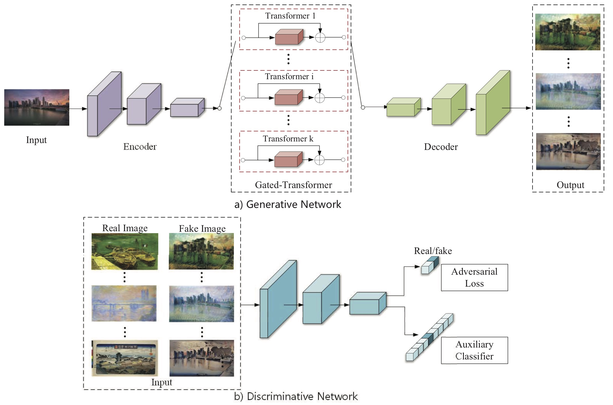
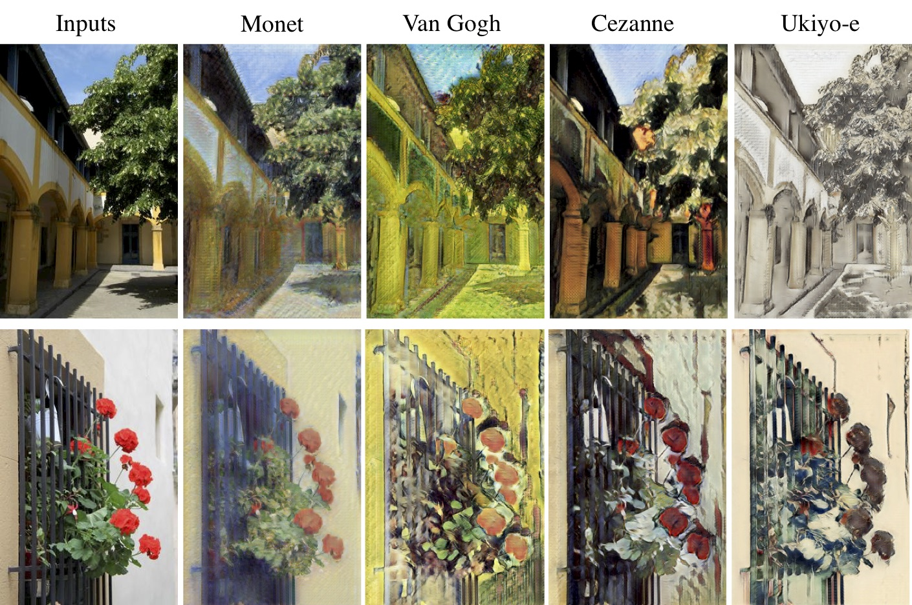

# Gated-GAN: Adversarial Gated Networks for Multi-Collection Style Transfer.

This repository contains the Torch code for our paper [“Gated-GAN: Adversarial Gated Networks for Multi-Collection Style Transfer”](https://ieeexplore.ieee.org/document/8463508). This code is based on the Torch implementation of CycleGAN provided by [Junyan Zhu](https://github.com/junyanz/CycleGAN). You may need to train several times as the quality of the results are sensitive to the initialization.

Our model architecture is defined as depicted below, please refer to the paper for more details: 


## Results

The results bellow are from sigle network:  


### Training
    ```bash
    bash train.sh
    ```

### Testing
    ```bash
    bash test.sh
